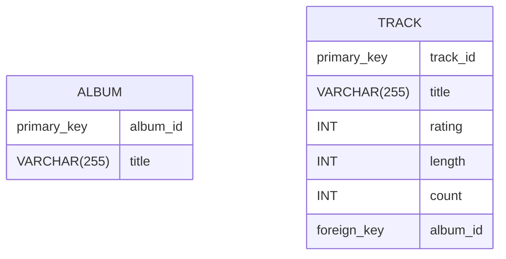
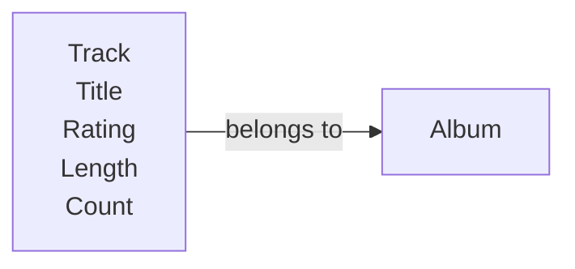

There are *tons* of database theory - way too much to understand without excessive predicate calculus.

- Do not replicate data. Instead, reference data. Point to the data.
- Use integers for keys and references.
- Add a special "key" column to each table, which you will make references to.

## Integer Reference Pattern

We use integer columns in one table to reference (or look up) rows in another table.

## Resources

[Database normalization - Wikipedia](https://en.wikipedia.org/wiki/Database_normalization)
[Introduction of database normalization - GeeksForGeeks](https://www.geeksforgeeks.org/introduction-of-database-normalization/)
[Database Normalization – Normal Forms 1nf 2nf 3nf Table Examples - FreeCodeCamp](https://www.freecodecamp.org/news/database-normalization-1nf-2nf-3nf-table-examples/)
