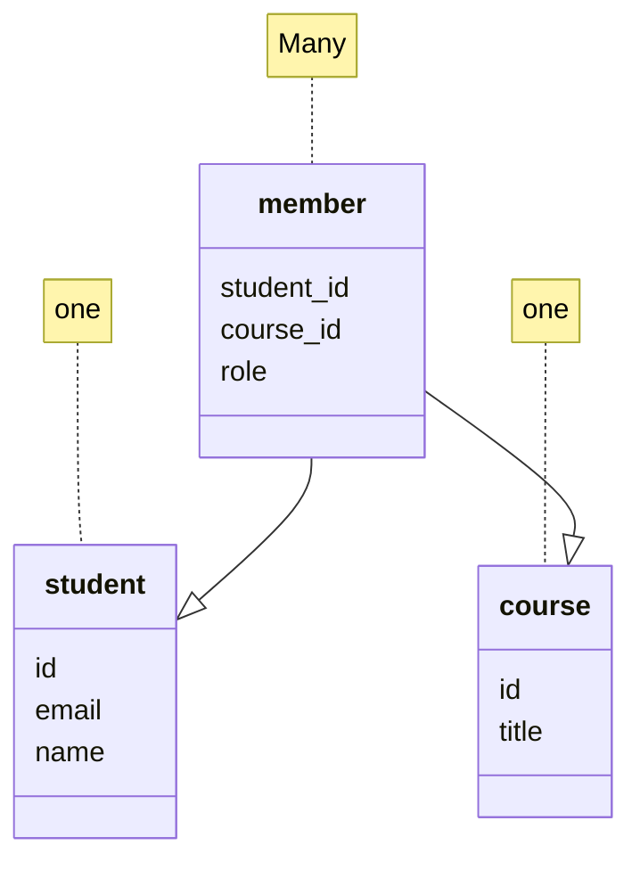

Sometimes we need to model a many-to-many relationship.
We need to add a "connection" table with two foreign keys.
There is usually no separate primary key.

## Example
```postgresql
CREATE TABLE student(
	id SERIAL,
	name varchar(128),
	email varchar(128) UNIQUE,
	PRIMARY KEY(id)
);

CREATE TABLE course(
	id SERIAL,
	title varchar(128) UNIQUE,
	PRIMARY KEY(id)
)

```



```postgresql
CREATE TABLE member(
	student_id INTEGER REFERENCES student(id) ON DELETE CASCADE,
	course_id INTEGER REFERENCES course(id) ON DELETE CASCADE,
	role INTEGER,
	PRIMARY KEY(student_id,course_id)
);
```
## Complexity Enables Speed
- Complexity enables speed, allowing you to achieve speedy results as the data size increases.
- By normalizing the data and linking it with integer keys, the overall amount of data that the relational database must scan is significantly reduced compared to if the data were flattened.
- It might seem like a tradeoff - spend some time designing your database so that it continues to be fast when your application is successful.

## Exercise 
```postgresql
CREATE TABLE student (
    id SERIAL,
    name VARCHAR(128) UNIQUE,
    PRIMARY KEY(id)
);

DROP TABLE course CASCADE;
CREATE TABLE course (
    id SERIAL,
    title VARCHAR(128) UNIQUE,
    PRIMARY KEY(id)
);

DROP TABLE roster CASCADE;
CREATE TABLE roster (
    id SERIAL,
    student_id INTEGER REFERENCES student(id) ON DELETE CASCADE,
    course_id INTEGER REFERENCES course(id) ON DELETE CASCADE,
    role INTEGER,
    UNIQUE(student_id, course_id),
    PRIMARY KEY (id)
);
```

> `DROP TABLE course CASCADE;` Delete the course table and automatically delete any other database objects (like foreign key constraints or dependent views) that depend on it.

| Action           | Effect on roster                     |
| ---------------- | ------------------------------------ |
| Delete a student | Removes all their course enrollments |
| Delete a course  | Removes all enrolled students in it  |
