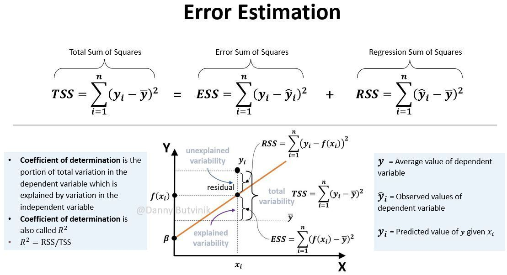
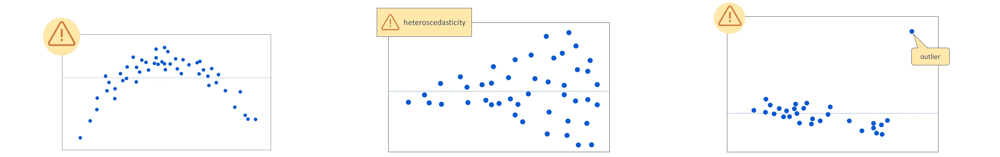

# Polynomial regression

- ESS: The comparison between predicted value and average actual value—*how much we can improve from the average*.
- TSS: The comparison between actual value and average actual value—*the sum of variance*. TSS doesn't care of
  predictor.

## $R^2$ Coefficient of Determination

$R^2$ is the proportion of variance in the dependent variable that can be explained by the independent variable(s). It
is a measure of how well the model fits the data.

- How much variance is explained by the regression model?
    - Total variation: TSS
    - Missed Variation: RSS
    - Explained Variation: ESS
- $R^2 = 1 - \frac{RSS}{TSS} = \frac{ESS}{TSS}$
- $R^2$ shows only association NOT causality.
- $R^2$ shows the magnitude of the association, not whether this association is statistically significant.
- $R^2$: How much variance is explained by the regression?
  - 1: All variance is explained by the regression. Is this good? 🤔
  - 0: No variance is explained by the regression. WORST!!!😞

## Assumptions

Now let's verify our assumptions.

Residuals will...

- have a constant variance
- be approximately normally distributed
- be independent of one another

Residual by predict plot is a visual way to check.

## Residual by prediction

- In the first graph you can see for a smaller $X$, and for the larger $X$ you are getting a larger residue, so this one
  is indicating you may not have a linear true relationship
- In the second graph we can see at the beginning, for the $X$ we have a pretty normal residual, and after that we have
  a lot of variants of the residual. Basically, this means that your observation may not be independently observed.
- In the last one we can see our residual is normally fine for most of the data points, however, we see some extremely
  high residual over some $x$s, and that is indicating you have an outlier.

See this [article](https://www.jmp.com/en/statistics-knowledge-portal/what-is-regression/simple-linear-regression-assumptions)

## Polynomial regression

If a straight line is not possible, then don't use straight line regression. We can use polynomial regression instead.

- Regression with polynomial features, $x, x^2, x^3,\dots, x^n$

Example: $y = ax^2 + bx + c$ is quadratic regression.

We need to calculate the coefficients $a, b, c$.

PolynomialFeatures(**d**) turns an **n** features to $\frac{\left(n+d\right)!}{n!d!}$ features.

